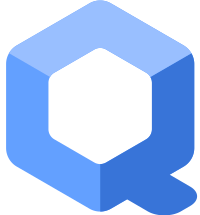
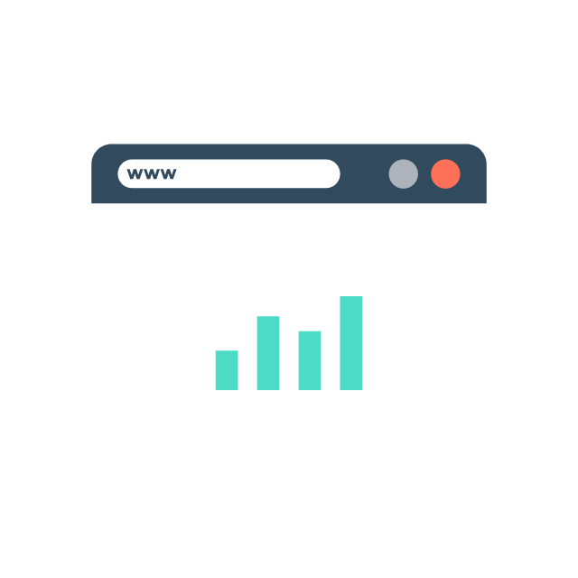
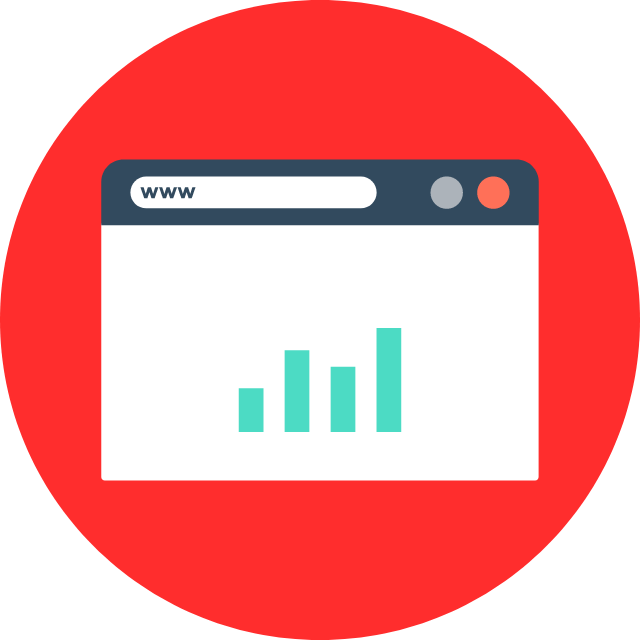
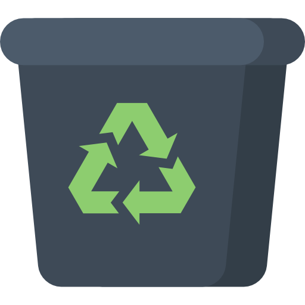
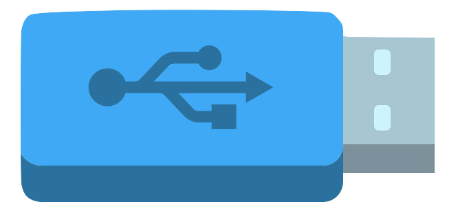

<!-- $theme: gaia -->
<!-- $size: 16:9 -->
<!-- *template: invert -->
#### &nbsp;

#  
 QubesOS

#### 
 A reasonably secure operating system

---
# A security-oriented
# ==operating system (OS)==
---
<!-- *template: invert -->
# Recommended by Some
 &nbsp;"If you're serious about security, Qubes OS is the best OS available today. It's what I use, and free." 
#### ***Edward Snowden***

###### &nbsp;

&nbsp;"When I use Qubes I feel like a god. Software thinks that it's in control, that it can do what it wants? It can't. I'm in control." 
#### ***Micah Lee***
---
# On a typical computer

**Passwords** | **Documents** | **One browser** | All your life 

---
<!-- *template: invert -->
## Security by
# **Compartmentalization** 

---
<!-- *template: invert -->
## Security by
# **Compartmentalization** 

 .Personal&nbsp; Banking Work  Vault
  
 (Offline)

---
<!-- *template: invert -->
 # **Virtual Machines** 
 ## ==Isolation==

  
---

<!-- *template: invert -->
###### &nbsp;

 .Personal&nbsp; Banking Work  Vault
  
 (Offline)

## All of these are ==Virtual Machines==

---
<!-- *template: invert -->
# Virus Resistant 

&nbsp;

   

# &nbsp;&nbsp;&nbsp;&nbsp;&nbsp;&nbsp;&nbsp;&nbsp;&nbsp;>>>> 
# &nbsp;&nbsp;&nbsp;&nbsp;&nbsp;&nbsp;&nbsp;&nbsp;&nbsp;Copy
 where you The one
 **Install Software** **You use**
&nbsp;

### only ==documents== are kept on ==restart==

---

<!-- *template: gaya -->
# Disposable Virtual Machines

&nbsp;

#### &nbsp;
## Once you close them, everything goes away...

---

<!-- *template: gaia -->
# Tor isolation
with the help of Whonix Virtual Machines
&nbsp;

&nbsp; &nbsp;

---
<!-- *template: invert -->
# Hardware Isolation
&nbsp;

&nbsp;

## No automount
#### You choose which computer it is attached to

---
<!-- *template: gaia -->
# The Sad news...

---
<!-- *template: gaia -->
### This is not for everyone
* Battery life is cut in Half
* Requires modern "beefy" computer
* Requires changing habits

&nbsp;
&nbsp;
&nbsp;

# We are still a few years away 
 from having this level of isolation for the regular user

---
<!-- *template: invert -->

# In case you want to try it...

# 
 qubes-os.org 

---
<!-- *template: invert -->
<!-- left blank on purpose-->
